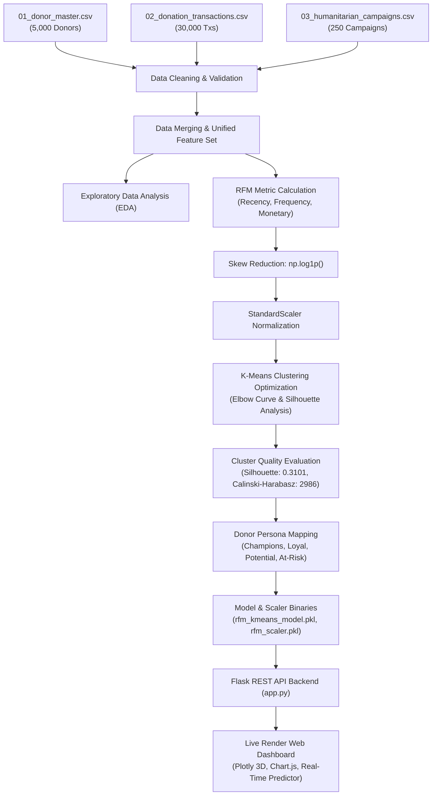

# 🌐 Humanitarian Micro-Donation Analytics & RFM Donor Segmentation

<div align="center">


### 🚀 **[Experience Live Web Dashboard Demo](https://micro-donation-rfm-dashboard.onrender.com)** 🚀

*An enterprise-grade Machine Learning solution for humanitarian donation analytics, dynamic RFM feature extraction, K-Means cluster profiling, real-time donor persona classification, and glassmorphism visual intelligence.*

</div>

---

## 📌 Executive Summary

Humanitarian non-profit organizations often face challenges in maintaining long-term donor engagement, optimizing campaign marketing efficiency, and identifying at-risk contributors before churn occurs. 

This repository delivers an **end-to-end Machine Learning Pipeline & Interactive Intelligence Dashboard** that analyzes over **30,000 micro-donation transactions** across **5,000 donors** and **250 humanitarian aid campaigns**. Using **Recency, Frequency, and Monetary (RFM)** behavior modeling paired with **log-transformed K-Means Clustering**, the system automatically categorizes donors into 4 actionable personas and provides real-time ML-powered segment prediction.

---

## 🏗️ End-to-End System Architecture



---

## 🔬 Machine Learning & RFM Methodology

### 1. Feature Engineering: RFM Metrics
- **Recency ($R$)**: Number of days elapsed between the donor's latest donation and baseline snapshot date (`2016-11-21`).
  $$R = \text{Snapshot Date} - \max(\text{Transaction Date}_i)$$
- **Frequency ($F$)**: Total count of verified successful donation transactions (`successful_payment == 1`).
  $$F = \sum \mathbf{1}(\text{successful\_payment} = 1)$$
- **Monetary ($M$)**: Cumulative sum of donation amounts ($USD) contributed by the donor.
  $$M = \sum \text{donation\_amount}_i$$
- **Average Donation**: $M / F$ per donor.

### 2. Feature Transformation & Standardization
Distance-based algorithms like **K-Means** require symmetric, non-skewed feature distributions. 
- **Log Transformation**: Applied $f(x) = \ln(1 + x)$ to eliminate extreme right skewness across Recency, Frequency, and Monetary metrics.
- **Standardization**: Applied `StandardScaler` to transform features to zero mean ($\mu = 0$) and unit variance ($\sigma = 1$).

### 3. Model Optimization & Evaluation
We evaluated cluster counts $k \in [2, 8]$ using three core validation metrics:

| Clusters ($k$) | Inertia (WCSS) | Silhouette Score | Calinski-Harabasz Index | Davies-Bouldin Index |
| :---: | :---: | :---: | :---: | :---: |
| $k=2$ | 8724.66 | 0.3673 | 3568.12 | 1.0293 |
| $k=3$ | 6570.46 | 0.3165 | 3185.88 | 1.0790 |
| **$k=4$ (Optimal)** | **5210.05** | **0.3101** | **2986.04** | **1.0043** |
| $k=5$ | 4446.54 | 0.2982 | 2948.04 | 0.9994 |
| $k=6$ | 3834.23 | 0.2788 | 2893.69 | 1.0145 |

> **Selection Rationale**: $k=4$ provides the sharpest elbow inflection point, high cluster cohesion, and the most business-interpretable donor personas.

---

## 🎯 Donor Personas & Business Insights

```
                       RECENCY vs MONETARY MATRIX
                       
             High Monetary                Low Monetary
          +--------------------------+--------------------------+
          |                          |                          |
  Low     |        CHAMPIONS         |    POTENTIAL LOYALISTS   |
 Recency  |   • Recency: ~22.6 days  |   • Recency: ~236.0 days |
          |   • Freq: 6.78 txs       |   • Freq: 4.31 txs       |
          |   • Monetary: $240.56    |   • Monetary: $140.02    |
          |                          |                          |
          +--------------------------+--------------------------+
          |                          |                          |
  High    |       LOYAL DONORS       |   AT-RISK / HIBERNATING  |
 Recency  |   • Recency: ~156.7 days |   • Recency: ~418.2 days |
          |   • Freq: 7.71 txs       |   • Freq: 1.95 txs       |
          |   • Monetary: $297.70    |   • Monetary: $49.24     |
          |                          |                          |
          +--------------------------+--------------------------+
```

### Strategic Action Playbook:
1. 🟢 **Champions** *(Emerald)*: Invite to Donor Advisory Panel, grant early-access sponsorship for emergency relief campaigns, send executive VIP appreciation gifts.
2. 🔵 **Loyal Donors** *(Blue)*: Convert to monthly automated giving subscriptions, send quarterly impact newsletters, schedule annual gratitude calls.
3. 🟡 **Potential Loyalists** *(Amber)*: Trigger donation-matching offers, share beneficiary story spotlights, send personalized multi-channel nudges.
4. 🔴 **At-Risk / Hibernating** *(Red)*: Deploy win-back re-engagement surveys, introduce low-friction micro-donations ($5–$10), send urgent disaster relief callouts.

---

## 💻 Web Dashboard Features

Our live dashboard (`https://micro-donation-rfm-dashboard.onrender.com`) is built with a modern dark glassmorphism aesthetic:

### 1. Executive Summary & KPI Metrics
- **Real-Time KPIs**: Total Donors (5,000), Total Monies Raised ($1,154,320+), Avg Donation ($39.65), Verified Successful Txs (29,110), Top Country (Peru).
- **Interactive 3D RFM Cluster Visualizer**: Fully rotatable, zoomable Plotly 3D scatter plot mapping every donor in $(R, F, M)$ space.

### 2. Demographics & Campaign Analytics
- Country distribution map, donor type split (Individual vs NGO vs Small Business), aid campaign funding performance, and 3-year monthly donation trend timeline.

### 3. Interactive Donor Directory Table
- Instant keyword search by Donor ID, Country, or Donor Type.
- Filter dropdowns for Segment Name and Donor Type.
- Paginated table with status badges and instant **1-Click CSV Export**.
- Modal viewer showing complete donor demographic profile and 10 most recent transactions.

### 4. Real-Time RFM Segment Predictor
- **Lookup Mode**: Enter any Donor ID (e.g. `100001`) to pull live profile, segment badge, and recommendation.
- **Custom Input Mode**: Enter custom Recency, Frequency, and Monetary values. The backend executes log-transform + `StandardScaler` normalization + K-Means model prediction to output segment classification, match confidence score (%), and strategic action plan.

---

## 📡 REST API Documentation

The Flask backend exposes clean JSON API endpoints:

| Endpoint | Method | Description | Sample Query / Payload |
| :--- | :---: | :--- | :--- |
| `/api/summary` | `GET` | Returns high-level KPI metrics & segment distribution | None |
| `/api/rfm_scatter` | `GET` | Returns 3D coordinate point array for Plotly rendering | None |
| `/api/demographics` | `GET` | Returns breakdown by country, gender, age, donor type | None |
| `/api/campaigns` | `GET` | Returns campaign funding metrics and monthly trends | None |
| `/api/donors` | `GET` | Returns paginated list of donor records with filters | `?page=1&per_page=15&search=Peru` |
| `/api/donor/<id>` | `GET` | Returns full details & transaction history for a donor ID | `/api/donor/100001` |
| `/api/predict` | `POST` | Predicts donor segment via ML model for custom inputs | `{"recency": 15, "frequency": 8, "monetary": 350}` |

---

## 📁 Repository Structure

```
micro_donation/
├── app.py                         # Production Flask App & REST API Server
├── build_rfm_pipeline.py          # Data Processing & K-Means Model Builder
├── make_notebook.py               # Jupyter Notebook Generator Script
├── micro_donation.ipynb           # Executable End-to-End Jupyter Notebook
├── donor_rfm_segmented.csv        # Segmented Donor Dataset
├── cleaned_merged_donations.csv   # Unified Transaction Dataset
├── rfm_kmeans_model.pkl           # Saved K-Means Binary Model
├── rfm_scaler.pkl                 # Saved StandardScaler Binary
├── 01_donor_master.csv            # Source Donor Master Data
├── 02_donation_transactions.csv   # Source Transaction History
├── 03_humanitarian_campaigns.csv  # Source Campaign Data
├── templates/
│   └── index.html                 # Single Page Application HTML5 Template
├── static/
│   ├── css/styles.css             # Glassmorphism UI & Dark Theme System
│   └── js/dashboard.js            # Plotly 3D, Chart.js, & REST API Logic
├── requirements.txt               # Production Dependencies
├── Procfile                       # Gunicorn Web Server Entry Point
├── render.yaml                    # Render Blueprint Configuration
└── README.md                      # Project Documentation
```

---

## 🛠️ Local Installation & Development

### Prerequisites
- Python 3.9+ or Python 3.10+
- Git

### 1. Clone Repository & Setup Virtual Environment
```bash
git clone https://github.com/<your-username>/micro-donation-rfm.git
cd micro-donation-rfm

# Create virtual environment
python -m venv venv

# Activate virtual environment
# Windows:
venv\Scripts\activate
# macOS/Linux:
source venv/bin/activate
```

### 2. Install Dependencies
```bash
pip install -r requirements.txt
```

### 3. Run Pipeline & Start Local Server
```bash
# Process raw data and train K-Means model
python build_rfm_pipeline.py

# Launch Flask development server
python app.py
```
Open `http://127.0.0.1:5000` in your web browser.

---

## 🌐 Production Deployment (Render)

The application is deployed live on **Render** using a production **Gunicorn WSGI server**.

### Live URL:
🔗 **[https://micro-donation-rfm-dashboard.onrender.com](https://micro-donation-rfm-dashboard.onrender.com)**

### Build & Start Configuration:
- **Build Command**: `pip install -r requirements.txt`
- **Start Command**: `gunicorn app:app`
- **Environment**: `Python 3.10`

---

## 👤 Author & Acknowledgments

- **Developed by**: Antigravity AI Data Science Team
- **Domain**: Machine Learning, Unsupervised Clustering, Customer/Donor Relationship Management (CRM)
- **License**: Released under the [MIT License](LICENSE).

<div align="center">
  <sub>Built with ❤️ for Humanitarian Data Analytics</sub>
</div>
